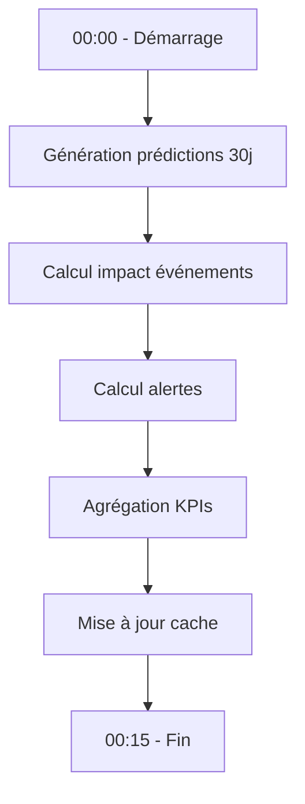

# Architecture Technique d'Optiflow

## 2.1 Vue d'Ensemble

L'architecture d'Optiflow suit une approche modulaire basée sur le pattern MVC (Model-View-Controller) adapté aux applications de data science. Le système est conçu pour être maintenable, extensible et performant tout en restant simple à déployer.

```
optiflow_mvp/
├── src/                    # Code source principal
│   ├── main.py            # Point d'entrée Streamlit
│   ├── pages/             # Vues (Interface utilisateur)
│   ├── utils/             # Utilitaires et services
│   └── components/        # Composants UI réutilisables
├── scripts_ml/            # Scripts Machine Learning
│   ├── orchestrator.py    # Orchestrateur batch
│   ├── Page_alertes/      # Scripts page alertes
│   └── training/          # Scripts entraînement
├── models/                # Modèles Prophet sauvegardés
├── tests/                 # Tests unitaires
├── doc/                   # Documentation
└── optiflow.db           # Base de données SQLite
```

## 2.2 Stack Technologique

### 2.2.1 Langage et Runtime
- **Python 3.8+** : Langage principal
  - Choisi pour son écosystème data science mature
  - Support natif SQLite
  - Excellente intégration avec les librairies ML

### 2.2.2 Framework Web
- **Streamlit 1.28+** : Framework d'interface utilisateur
  - Développement rapide d'applications data science
  - Composants interactifs natifs
  - Rechargement automatique en développement
  - Navigation native multi-pages

### 2.2.3 Base de Données
- **SQLite 3** : Système de gestion de base de données
  - Base embarquée, aucune installation serveur
  - Performances excellentes en lecture
  - Transactions ACID
  - Taille : ~10 MB avec 3 ans de données

### 2.2.4 Machine Learning
- **Prophet 1.1.4** : Prédiction de séries temporelles
  - Développé par Meta (Facebook)
  - Gestion automatique saisonnalités
  - Robuste aux données manquantes
  - Intervalles de confiance natifs

- **Scikit-learn 1.3+** : Outils ML complémentaires
  - Métriques de performance
  - Preprocessing des données
  - Détection d'anomalies

### 2.2.5 Visualisation
- **Plotly 5.15+** : Graphiques interactifs
  - Graphiques responsifs
  - Zoom et export natifs
  - Intégration Streamlit optimale

### 2.2.6 Autres Dépendances Clés
- **Pandas 2.0+** : Manipulation de données
- **NumPy 1.24+** : Calculs numériques
- **ReportLab 4.0+** : Génération PDF

## 2.3 Architecture Logicielle

### 2.3.1 Couche Présentation (src/pages/)

```python
pages/
├── dashboard.py       # Vue principale avec KPIs
├── alertes.py        # Gestion des alertes stocks
├── predictions.py    # Visualisation prédictions
└── amelioration.py   # Détection anomalies
```

**Responsabilités** :
- Affichage des données
- Interaction utilisateur
- Appel aux services métier
- Gestion du state Streamlit

### 2.3.2 Couche Services (src/utils/)

```python
utils/
├── database.py       # Service d'accès aux données
├── cache.py         # Gestion du cache 24h
├── workflow.py      # Orchestration des processus
├── orders.py        # Gestion des commandes
└── pdf_generator.py # Génération documents
```

**Patterns implémentés** :
- **Singleton** : Connexion DB unique
- **Repository** : Abstraction accès données
- **Service Layer** : Logique métier centralisée

### 2.3.3 Couche Machine Learning (scripts_ml/)

```python
scripts_ml/
├── orchestrator.py                    # Coordinateur principal
├── Page_alertes/
│   ├── predict_daily_sales.py        # Prédictions Prophet
│   ├── calculate_alerts.py           # Calcul alertes
│   ├── suggest_quantity.py           # Suggestions quantités
│   └── monitor_ml_performance.py     # Métriques ML
├── training/
│   ├── train_models.py               # Entraînement
│   └── validate_training.py          # Validation
└── prophet_anomaly_detector.py       # Détection anomalies
```

**Architecture ML** :
- Modèles indépendants par produit
- Cache des prédictions
- Réentraînement hebdomadaire

## 2.4 Workflow d'Exécution

### 2.4.1 Batch Nocturne (Minuit)



**Caractéristiques** :
- Exécution asynchrone via orchestrator.py
- Durée totale : ~15 minutes
- Parallélisation des tâches indépendantes
- Logging complet dans batch_optiflow.log

### 2.4.2 Cache et Performance

**Stratégie de cache à 2 niveaux** :

1. **Cache applicatif (24h)** :
   - Stockage : Fichiers JSON/CSV
   - TTL : 24 heures
   - Invalidation : Batch nocturne

2. **Cache Streamlit (5 min)** :
   ```python
   @st.cache_data(ttl=300)
   def load_dashboard_data():
       # Chargement optimisé
   ```

**Optimisations DB** :
- Index sur colonnes dates
- Vues matérialisées pour KPIs
- Requêtes CTE pour agrégations

## 2.5 Sécurité et Contraintes

### 2.5.1 Sécurité Base de Données

```python
class OptiflowDB:
    def execute_query(self, query, params=None):
        # Vérification requête SELECT uniquement
        if not query.upper().startswith('SELECT'):
            raise ValueError("Seules les SELECT autorisées")

        # Requêtes paramétrées contre injection SQL
        cursor.execute(query, params or [])
```

### 2.5.2 Contraintes Système

**Préservation structure DB** :
- Aucune modification du schéma existant
- Mapping logique/physique via db_mapping.py
- Backward compatibility garantie

**Limites techniques** :
- Max 1000 produits (performance)
- SQLite mono-utilisateur
- Pas de transactions concurrentes

## 2.6 Patterns et Bonnes Pratiques

### 2.6.1 Design Patterns Utilisés

1. **Repository Pattern**
   ```python
   class OrderManager:
       def save_order(self, order_data):
           # Abstraction de la persistance
   ```

2. **Factory Pattern**
   ```python
   class DailySalesPredictor:
       def _load_model(self, article_id):
           # Création dynamique des modèles
   ```

3. **Observer Pattern**
   - Streamlit callbacks pour interactions

### 2.6.2 Conventions de Code

- **Nommage** : snake_case (Python PEP 8)
- **Documentation** : Docstrings Google Style
- **Types** : Type hints Python 3.8+
- **Tests** : pytest avec coverage > 80%

## 2.7 Déploiement

### 2.7.1 Environnement Local

```bash
# Installation dépendances
pip install -r requirements.txt

# Lancement application
streamlit run src/main.py

# Exécution batch manuel
python scripts_ml/orchestrator.py
```

### 2.7.2 Configuration Production

**Serveur recommandé** :
- OS : Linux Ubuntu 20.04+
- RAM : 4 GB minimum
- CPU : 2 cores minimum
- Stockage : 20 GB SSD

**Automatisation** :
```cron
# Crontab pour batch nocturne
0 0 * * * cd /opt/optiflow && python scripts_ml/orchestrator.py
```

## 2.8 Monitoring et Logs

### 2.8.1 Système de Logging

```python
logging.basicConfig(
    level=logging.INFO,
    format='%(asctime)s - %(name)s - %(levelname)s - %(message)s',
    handlers=[
        logging.FileHandler('batch_optiflow.log'),
        logging.StreamHandler()
    ]
)
```

### 2.8.2 Métriques Surveillées

- **Performance** : Temps d'exécution batch
- **Précision** : MAPE des prédictions
- **Utilisation** : Nombre de connexions/jour
- **Erreurs** : Taux d'échec des prédictions

## 2.9 Évolutivité

### 2.9.1 Scalabilité Verticale
- Migration SQLite → PostgreSQL
- Augmentation ressources serveur
- Optimisation requêtes SQL

### 2.9.2 Scalabilité Horizontale
- Distribution des calculs ML
- Load balancing Streamlit
- Cache Redis distribué

## 2.10 Conclusion

L'architecture d'Optiflow combine pragmatisme et performance en utilisant des technologies éprouvées. La modularité du système permet une évolution progressive vers des solutions plus scalables tout en maintenant la simplicité opérationnelle du MVP.