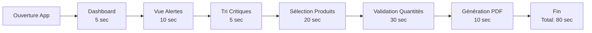

# Interface Utilisateur d'Optiflow

## 7.1 Philosophie de Design

L'interface d'Optiflow suit une approche "mobile-first" avec un design épuré centré sur l'efficacité opérationnelle. L'objectif est de permettre aux utilisateurs de prendre des décisions éclairées en moins de 2 minutes par jour.

### Principes Directeurs
- **Clarté** : Information hiérarchisée et visible immédiatement
- **Rapidité** : Temps de chargement < 2 secondes
- **Cohérence** : Code couleur uniforme (Rouge/Jaune/Vert)
- **Accessibilité** : Compatible tous navigateurs modernes

## 7.2 Framework Streamlit

### 7.2.1 Architecture de Navigation

```python
# Configuration de la navigation native Streamlit
page_dashboard = st.Page(
    "pages/dashboard.py",
    title="Dashboard",
    icon=":material/dashboard:",
    default=True  # Page par défaut
)

page_alertes = st.Page(
    "pages/alertes.py",
    title="Alertes",
    icon=":material/inventory:"
)

page_predictions = st.Page(
    "pages/predictions.py",
    title="Prédictions",
    icon=":material/trending_up:"
)

page_amelioration = st.Page(
    "pages/amelioration.py",
    title="Amélioration Système",
    icon=":material/engineering:"
)

# Navigation configurée
pg = st.navigation({
    "🎯 Optiflow": [
        page_dashboard,
        page_alertes,
        page_predictions,
        page_amelioration
    ]
})
```

### 7.2.2 Configuration de Page

```python
st.set_page_config(
    page_title="Optiflow - Gestion Intelligente des Stocks",
    page_icon="📦",
    layout="wide",  # Utilisation maximale de l'écran
    initial_sidebar_state="expanded",
    menu_items={
        'About': "Optiflow v1.0 - Système de gestion des stocks"
    }
)
```

## 7.3 Composants Visuels

### 7.3.1 Système de Couleurs

```python
# Palette de couleurs cohérente
COLORS = {
    'CRITIQUE': '#dc3545',     # Rouge vif
    'ATTENTION': '#ffc107',     # Orange/Jaune
    'OK': '#28a745',           # Vert
    'PRIMARY': '#007bff',      # Bleu principal
    'SECONDARY': '#6c757d',    # Gris
    'SUCCESS': '#28a745',      # Vert succès
    'INFO': '#17a2b8',         # Cyan info
    'WARNING': '#ffc107',      # Orange warning
    'DANGER': '#dc3545',       # Rouge danger
    'LIGHT': '#f8f9fa',        # Gris très clair
    'DARK': '#343a40'          # Gris foncé
}
```

### 7.3.2 Cards et Métriques

```python
def create_metric_card(title, value, delta=None, color=None):
    """Crée une carte métrique stylisée"""

    with st.container():
        if color:
            st.markdown(f"""
                <div style="
                    background-color: {color}20;
                    border-left: 4px solid {color};
                    padding: 10px;
                    border-radius: 5px;
                ">
            """, unsafe_allow_html=True)

        st.metric(
            label=title,
            value=value,
            delta=delta,
            delta_color="normal" if delta and delta > 0 else "inverse"
        )

        if color:
            st.markdown("</div>", unsafe_allow_html=True)
```

### 7.3.3 Graphiques Plotly

```python
def create_interactive_chart(data, chart_type="line"):
    """Génère un graphique interactif Plotly"""

    fig = go.Figure()

    if chart_type == "line":
        fig.add_trace(go.Scatter(
            x=data['date'],
            y=data['value'],
            mode='lines+markers',
            name='Valeur',
            line=dict(color=COLORS['PRIMARY'], width=2),
            marker=dict(size=8)
        ))

    # Configuration layout
    fig.update_layout(
        template="plotly_white",
        height=400,
        margin=dict(l=0, r=0, t=30, b=0),
        hovermode='x unified',
        showlegend=True,
        xaxis=dict(
            showgrid=True,
            gridwidth=1,
            gridcolor='LightGray'
        ),
        yaxis=dict(
            showgrid=True,
            gridwidth=1,
            gridcolor='LightGray'
        )
    )

    return fig
```

## 7.4 Layout et Responsive Design

### 7.4.1 Structure en Colonnes

```python
# Layout Dashboard - 3 colonnes principales
col1, col2, col3 = st.columns([2, 3, 2])

with col1:
    st.subheader("📊 KPIs Principaux")
    display_main_kpis()

with col2:
    st.subheader("📈 Tendances")
    display_trends_chart()

with col3:
    st.subheader("⚠️ Alertes Actives")
    display_active_alerts()
```

### 7.4.2 Containers et Expanders

```python
# Container pour section principale
with st.container():
    st.markdown("### 🎯 Alertes Critiques")

    # Expander pour détails
    with st.expander("Voir détails", expanded=False):
        st.write("Détails des alertes...")

        # Tabs pour organiser l'information
        tab1, tab2, tab3 = st.tabs(["Critique", "Attention", "Résolu"])

        with tab1:
            display_critical_alerts()
        with tab2:
            display_warning_alerts()
        with tab3:
            display_resolved_alerts()
```

### 7.4.3 Responsive Columns

```python
def create_responsive_layout():
    """Crée un layout adaptatif"""

    # Détection taille écran (approximative)
    if st.session_state.get('mobile_view', False):
        # Layout mobile : 1 colonne
        st.write("Content...")
    else:
        # Layout desktop : multi-colonnes
        cols = st.columns([1, 2, 1])
        with cols[1]:
            st.write("Content principal...")
```

## 7.5 Composants Interactifs

### 7.5.1 Formulaires et Inputs

```python
# Formulaire de configuration
with st.form("config_form"):
    st.markdown("### ⚙️ Configuration")

    # Date picker
    target_date = st.date_input(
        "Date cible de couverture",
        value=datetime.now() + timedelta(days=7),
        min_value=datetime.now(),
        max_value=datetime.now() + timedelta(days=30)
    )

    # Slider
    safety_margin = st.slider(
        "Marge de sécurité (%)",
        min_value=0,
        max_value=50,
        value=20,
        step=5,
        help="Pourcentage de stock supplémentaire"
    )

    # Select box
    product = st.selectbox(
        "Produit",
        options=products_list,
        format_func=lambda x: f"{x['name']} ({x['id']})"
    )

    # Submit button
    submitted = st.form_submit_button(
        "Calculer",
        type="primary",
        use_container_width=True
    )

    if submitted:
        process_form_data(target_date, safety_margin, product)
```

### 7.5.2 Tables Interactives

```python
def create_interactive_table(df):
    """Crée une table interactive avec tri et filtrage"""

    # Configuration colonnes
    column_config = {
        "product_name": st.column_config.TextColumn(
            "Produit",
            width="medium",
        ),
        "stock": st.column_config.NumberColumn(
            "Stock",
            format="%d",
            width="small",
        ),
        "alert_level": st.column_config.TextColumn(
            "Niveau",
            width="small",
        ),
        "action": st.column_config.ButtonColumn(
            "Action",
            help="Cliquer pour commander",
            disabled=False
        )
    }

    # Affichage avec sélection
    selected = st.dataframe(
        df,
        column_config=column_config,
        hide_index=True,
        use_container_width=True,
        on_select="rerun",
        selection_mode="multi-row"
    )

    return selected
```

### 7.5.3 Boutons d'Action

```python
# Boutons avec styles différents
col1, col2, col3 = st.columns(3)

with col1:
    if st.button("✅ Valider", type="primary", use_container_width=True):
        validate_action()

with col2:
    if st.button("⚠️ Modifier", type="secondary", use_container_width=True):
        modify_action()

with col3:
    if st.button("❌ Annuler", use_container_width=True):
        cancel_action()
```

## 7.6 Feedback et Notifications

### 7.6.1 Messages de Statut

```python
# Success message
st.success("✅ Commande créée avec succès!")

# Warning message
st.warning("⚠️ Stock faible détecté pour 3 produits")

# Error message
st.error("❌ Erreur lors de la génération des prédictions")

# Info message
st.info("ℹ️ Les prédictions sont mises à jour quotidiennement à minuit")
```

### 7.6.2 Progress Bars

```python
def show_processing():
    """Affiche une barre de progression"""

    progress_bar = st.progress(0, text="Traitement en cours...")

    for i in range(100):
        time.sleep(0.01)
        progress_bar.progress(i + 1, text=f"Traitement: {i+1}%")

    st.success("Traitement terminé!")
```

### 7.6.3 Toasts et Ballons

```python
# Toast notification (temporaire)
st.toast("📊 Données actualisées", icon="✅")

# Balloons pour célébration
if all_alerts_resolved:
    st.balloons()
    st.success("🎉 Toutes les alertes sont résolues!")
```

## 7.7 Sidebar et Navigation

### 7.7.1 Configuration Sidebar

```python
with st.sidebar:
    # Logo et titre
    st.image("assets/logo.png", width=100)
    st.title("🎯 Optiflow")

    st.divider()

    # État système
    st.markdown("### 🔧 État du Système")
    col1, col2 = st.columns(2)

    with col1:
        st.metric("État", "● OK", delta=None)

    with col2:
        st.metric("Version", "1.0", delta=None)

    # Dernière mise à jour
    st.caption(f"Dernière MAJ: {get_last_update()}")

    st.divider()

    # Filtres globaux
    st.markdown("### 🔍 Filtres")

    date_range = st.date_input(
        "Période",
        value=(datetime.now() - timedelta(days=7), datetime.now()),
        format="DD/MM/YYYY"
    )

    categories = st.multiselect(
        "Catégories",
        options=get_categories(),
        default=None
    )

    # Actions rapides
    st.divider()
    st.markdown("### ⚡ Actions Rapides")

    if st.button("🔄 Rafraîchir", use_container_width=True):
        st.rerun()

    if st.button("📥 Exporter", use_container_width=True):
        export_data()

    if st.button("⚙️ Paramètres", use_container_width=True):
        open_settings()
```

## 7.8 Thèmes et Personnalisation

### 7.8.1 Configuration du Thème

```toml
# .streamlit/config.toml
[theme]
primaryColor = "#007bff"
backgroundColor = "#ffffff"
secondaryBackgroundColor = "#f8f9fa"
textColor = "#262730"
font = "sans serif"

[server]
headless = true
port = 8501

[browser]
gatherUsageStats = false
```

### 7.8.2 CSS Personnalisé

```python
def inject_custom_css():
    """Injecte du CSS personnalisé"""

    st.markdown("""
    <style>
    /* Arrondis des cards */
    div[data-testid="metric-container"] {
        background-color: #f8f9fa;
        border: 1px solid #dee2e6;
        border-radius: 10px;
        padding: 15px;
        box-shadow: 0 2px 4px rgba(0,0,0,0.1);
    }

    /* Boutons personnalisés */
    .stButton > button {
        border-radius: 20px;
        transition: all 0.3s;
    }

    .stButton > button:hover {
        transform: translateY(-2px);
        box-shadow: 0 4px 8px rgba(0,0,0,0.2);
    }

    /* Tables stylisées */
    .dataframe {
        border-radius: 10px;
        overflow: hidden;
    }

    /* Alertes colorées */
    .alert-critical {
        background-color: #dc354520;
        border-left: 4px solid #dc3545;
    }

    .alert-warning {
        background-color: #ffc10720;
        border-left: 4px solid #ffc107;
    }

    .alert-ok {
        background-color: #28a74520;
        border-left: 4px solid #28a745;
    }
    </style>
    """, unsafe_allow_html=True)
```

## 7.9 Performance et Optimisation UI

### 7.9.1 Lazy Loading

```python
@st.fragment
def load_heavy_component():
    """Charge un composant lourd de manière asynchrone"""

    with st.spinner("Chargement..."):
        # Simulation chargement
        data = fetch_large_dataset()
        chart = create_complex_visualization(data)

    return chart

# Utilisation
if st.button("Afficher graphique détaillé"):
    chart = load_heavy_component()
    st.plotly_chart(chart)
```

### 7.9.2 Caching UI

```python
@st.cache_data(ttl=300)  # Cache 5 minutes
def get_dashboard_data():
    """Cache les données du dashboard"""
    return fetch_from_database()

@st.cache_resource
def init_heavy_resources():
    """Cache les ressources lourdes"""
    return load_ml_models()
```

### 7.9.3 Pagination

```python
def paginated_display(data, items_per_page=20):
    """Affichage paginé pour grandes listes"""

    # Calcul pages
    total_pages = len(data) // items_per_page + 1

    # Sélecteur de page
    page = st.number_input(
        "Page",
        min_value=1,
        max_value=total_pages,
        value=1
    )

    # Slice data
    start_idx = (page - 1) * items_per_page
    end_idx = start_idx + items_per_page

    # Affichage
    st.dataframe(data[start_idx:end_idx])

    # Navigation
    col1, col2, col3 = st.columns([1, 2, 1])
    with col1:
        if page > 1:
            if st.button("◀ Précédent"):
                st.session_state.page = page - 1
                st.rerun()

    with col2:
        st.write(f"Page {page}/{total_pages}")

    with col3:
        if page < total_pages:
            if st.button("Suivant ▶"):
                st.session_state.page = page + 1
                st.rerun()
```

## 7.10 Accessibilité

### 7.10.1 Support Clavier

```python
# Navigation clavier
st.markdown("""
<script>
document.addEventListener('keydown', function(e) {
    // Alt + D : Dashboard
    if (e.altKey && e.key === 'd') {
        window.location.href = '/?page=dashboard';
    }
    // Alt + A : Alertes
    if (e.altKey && e.key === 'a') {
        window.location.href = '/?page=alertes';
    }
    // Alt + P : Prédictions
    if (e.altKey && e.key === 'p') {
        window.location.href = '/?page=predictions';
    }
});
</script>
""", unsafe_allow_html=True)
```

### 7.10.2 Contraste et Lisibilité

```python
def ensure_accessibility():
    """Assure l'accessibilité de l'interface"""

    # Taille de police minimale
    st.markdown("""
    <style>
    body {
        font-size: 16px;
        line-height: 1.6;
    }

    /* Contraste élevé pour texte important */
    .critical-text {
        color: #000000;
        font-weight: bold;
    }

    /* Focus visible */
    *:focus {
        outline: 3px solid #007bff;
        outline-offset: 2px;
    }
    </style>
    """, unsafe_allow_html=True)
```

## 7.11 Workflow Utilisateur Type

### 7.11.1 Parcours Matin (2 minutes)



### 7.11.2 Interactions Optimisées

1. **Ouverture** : Dashboard pré-chargé
2. **Navigation** : 1 clic vers alertes
3. **Filtrage** : Auto-focus sur critiques
4. **Sélection** : Multi-sélection rapide
5. **Validation** : Bouton unique
6. **Export** : Génération automatique

## 7.12 Conclusion

L'interface utilisateur d'Optiflow combine simplicité et efficacité grâce à Streamlit. Le design épuré, les interactions optimisées et le code couleur cohérent permettent une prise en main immédiate et une utilisation quotidienne en moins de 2 minutes, répondant parfaitement aux besoins des gestionnaires de stock.